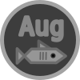

= Silverfish
image:https://github.com/carpetmaker3162/silverfish/actions/workflows/go.yml/badge.svg[Build and Test, link="https://github.com/carpetmaker3162/silverfish/actions/workflows/go.yml"]

Chess Engine (work-in-progress). Maybe one day we'll be able to compete with Stockfish, but who knows?

== Quickstart

The engine itself has no external dependencies besides Go 1.22.x, so it should just work.

[source,bash]
----
go run ./cmd/silverfish
----

Although, it doesn't really do much for now.
